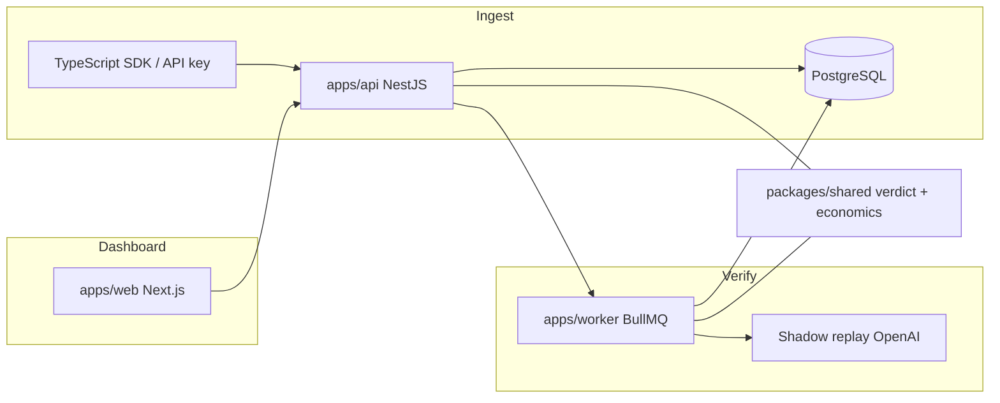

# SentinelAI

Verified model switching for LLM applications. SentinelAI ingests production traces, identifies same-provider downgrade candidates per task, replays sampled prompts against the candidate model, and returns a switch recommendation with estimated savings and per-replay evidence.

Switch outcomes:

- **Safe to switch** — pass rate ≥ 90% and zero critical failures
- **Needs review** — pass rate ≥ 75%
- **Do not switch** — pass rate &lt; 75%

Pass rate is `passed / (passed + borderline + failed)`. Borderline replays count against the rate but are not classified as failures.

## Capabilities

- Trace ingestion via REST API or TypeScript SDK
- Task-level cost and quality analytics
- Same-provider model recommendations from catalog pricing
- Background shadow verification (simulate or live provider replay)
- Per-replay verdicts: pass, borderline, or fail, with reasons and risk categories
- Dashboard for overview, tasks, verification evidence, traces, and project settings

## Architecture



| Package | Role |
| --- | --- |
| `apps/api` | Auth, projects, ingestion, analytics, recommendations, verifications |
| `apps/worker` | BullMQ evaluations and shadow experiments |
| `apps/web` | Dashboard (Overview, Tasks, Verification, Traces, Settings) |
| `packages/shared` | Replay verdicts, switch rules, shadow economics |
| `packages/sdk` | Client library for trace ingestion |
| `prisma/` | Schema and migrations |

## Verification workflow

1. Ingest production traces for a project.
2. Configure task profiles (quality threshold, optimization goal) in Settings.
3. Request recommendations; the API queues shadow experiments for verifiable same-provider candidates.
4. The worker samples up to `SHADOW_MAX_REPLAYS_PER_EXPERIMENT` traces (default 8), replays prompts, and scores responses.
5. Review results on the Verification page: aggregate summary, savings estimate, sample confidence, and replay evidence rows.

## Tech stack

TypeScript monorepo (npm workspaces): NestJS, Next.js, PostgreSQL, Prisma, Redis, BullMQ, Docker Compose.

## Getting started

```bash
npm install
cp .env.example .env
docker compose up -d postgres redis
npm run prisma:generate
npm run prisma:migrate
npm run dev:api
npm run dev:worker
npm run dev:web
```

- Web: `http://localhost:3000`
- API: `http://localhost:4000/api`

Copy `NEXT_PUBLIC_*` from `.env` into `apps/web/.env.local` when running the web app outside Docker.

### Docker

```bash
docker compose up -d --build api worker web
```

Recreate containers after changing `.env` (rebuild `web` when `NEXT_PUBLIC_*` changes).

### Environment variables

| Variable | Purpose |
| --- | --- |
| `DATABASE_URL` | PostgreSQL connection string |
| `REDIS_URL` | Redis for BullMQ |
| `JWT_SECRET` | JWT signing; fallback for provider credential encryption |
| `SHADOW_REPLAY_MODE` | `simulate` (reuse stored evaluation scores) or `api` (live replay) |
| `SHADOW_MAX_REPLAYS_PER_EXPERIMENT` | Max replays per experiment (default `8`) |
| `SHADOW_MIN_SAVINGS_USD` | Minimum estimated savings to queue shadow work |
| `OPENAI_API_KEY` | Live replay and optional LLM judge (Settings or env) |
| `PROVIDER_CREDENTIALS_SECRET` | Encrypts per-project provider keys (defaults to `JWT_SECRET`) |

## Demo data

In Settings, **Load demo traffic** seeds a project with `support.answer` traces on `gpt-4.1` and a task profile for cost reduction. Run verification from Overview to shadow-test `gpt-4.1-mini`.

```bash
PROJECT_ID=<project-id> npm run demo:seed
npm run smoke
./scripts/e2e-recommendations.sh   # requires API and worker
```

Use `SHADOW_REPLAY_MODE=simulate` for local verification without provider API keys.

## Application routes

| Route | Description |
| --- | --- |
| `/dashboard` | Spend, savings opportunity, latest verification, run verification |
| `/tasks` | Per-task models, candidates, verification status |
| `/verification` | Verification summary and replay evidence |
| `/traces` | Trace list and detail |
| `/settings` | OpenAI credentials, task thresholds, ingestion keys, demo seed |

Redirects: `/projects` → `/settings`, `/catalog` → `/dashboard`.

## Development

```bash
npm run build -w @sentinelai/shared
npm run test
npm run build --workspace=@sentinelai/web
npm run build --workspace=@sentinelai/api
```

## Roadmap

Not in the current release: billing, multi-tenant RBAC, multi-provider marketplace UI, and broad observability dashboards. Cross-provider shadow replay exists in the worker but is not exposed in the primary UI.
