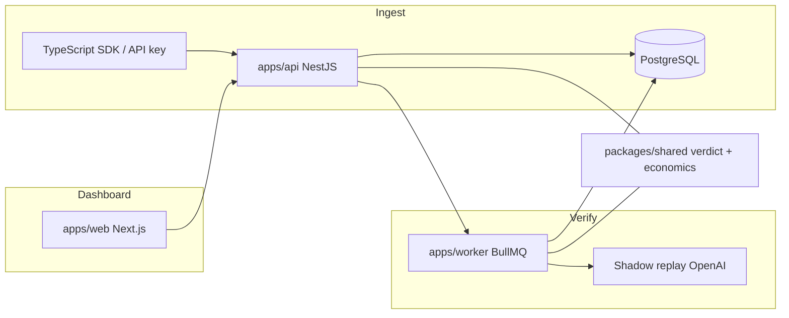

# SentinelAI

**Verified model switching for small AI teams** — not another generic observability dashboard.

SentinelAI ingests production LLM traces, finds a cheaper **same-provider** model for each task, replays real prompts in the background, and returns a decisive recommendation: **Safe to switch**, **Needs review**, or **Do not switch** — with estimated savings and per-replay evidence.

## Why this is not just observability

| Generic observability | SentinelAI |
| --- | --- |
| Latency/token charts | Shadow replay on **your** prompts |
| “Try a smaller model” guesses | Pass / borderline / fail with reasons |
| Benchmarks | Quality vs your task threshold |
| Open-ended analytics | One golden path: verify → switch → save |

## Architecture



- **`apps/api`**: Auth, projects, trace ingestion, analytics, recommendations, verifications API.
- **`apps/worker`**: BullMQ jobs — evaluations and shadow experiments (simulate or live replay).
- **`apps/web`**: Five-page product shell — Overview, Tasks, Verification, Traces, Settings.
- **`packages/shared`**: Shared contracts, replay verdicts, switch status rules, shadow economics caps.
- **`packages/sdk`**: Send traces from your app.
- **`prisma/`**: PostgreSQL schema and demo seed.

## Core flow (golden path)

1. **Ingest** production traces (SDK or demo seed in Settings).
2. **Tasks** — SentinelAI groups traffic by task name and spots expensive models.
3. **Run verification** — worker samples up to 8 prompts, replays against the candidate model, scores semantic quality + hallucination risk.
4. **Verification page** — summary card (pass/borderline/fail, savings, confidence) + replay evidence table.
5. **Switch decision** — shared rules everywhere:
   - **Safe to switch**: pass rate ≥ 90% and zero critical failures
   - **Needs review**: pass rate ≥ 75%
   - **Do not switch**: pass rate &lt; 75%

Pass rate = `passed / (passed + borderline + failed)` — borderline rows count against the rate but are not failures.

## Tech stack

- TypeScript monorepo (npm workspaces)
- NestJS, Next.js, Tailwind
- PostgreSQL + Prisma
- Redis + BullMQ
- Docker Compose for local full stack

## Local setup

```bash
npm install
cp .env.example .env
docker compose up -d postgres redis
npm run prisma:generate
npm run prisma:migrate
npm run dev:api
npm run dev:worker
npm run dev:web
```

Web: `http://localhost:3000` · API: `http://localhost:4000/api`

Copy `NEXT_PUBLIC_*` from `.env` into `apps/web/.env.local` when running the web app outside Docker.

### Docker (all services)

```bash
docker compose up -d --build api worker web
```

After changing `.env`, recreate containers (rebuild **web** if `NEXT_PUBLIC_*` changed).

### Key environment variables

| Variable | Purpose |
| --- | --- |
| `DATABASE_URL` | PostgreSQL |
| `REDIS_URL` | BullMQ |
| `JWT_SECRET` | Auth + credential encryption fallback |
| `SHADOW_REPLAY_MODE` | `simulate` (dev, uses stored scores) or `api` (live replay) |
| `SHADOW_MAX_REPLAYS_PER_EXPERIMENT` | Default `8` samples per verification |
| `OPENAI_API_KEY` | Optional in Settings for live replay / judge |

## Demo walkthrough (resume-friendly)

1. Sign in, create or select a project.
2. **Settings → Load demo traffic** — renames project to **SupportBot Demo**, seeds 14 `support.answer` traces on `gpt-4.1` (one row at ~0.78 semantic for a borderline replay).
3. **Overview → Run verification** — same-provider candidate `gpt-4.1-mini`, ~8 replays, typically **7 pass / 1 borderline** → **Needs review** at 87.5% with strong savings estimate.
4. Open **Verification** — read the “Verified model switch” summary and expand replay evidence (prompt + response previews, reasons, risk categories).
5. Optional: add OpenAI key in Settings and set `SHADOW_REPLAY_MODE=api` for live replay.

```bash
npm run smoke
./scripts/e2e-recommendations.sh   # with API + worker up
```

## Product pages

| Route | Purpose |
| --- | --- |
| `/dashboard` | “Can I safely switch?” — savings, spend, latest verification, CTA |
| `/tasks` | Per-task models and verification status |
| `/verification` | Summary + replay evidence |
| `/traces` | Prompt/response explorer |
| `/settings` | OpenAI key, thresholds, demo seed, ingestion keys |

Legacy routes redirect: `/projects` → Settings, `/catalog` → Overview.

## Intentionally deferred

- Billing, teams, RBAC
- Multi-provider marketplace UI
- Broad “AI analytics” / signal-room style dashboards
- Stripe, enterprise settings

Cross-provider replay code remains for future use but is not surfaced in the main UI.

## Commands

```bash
npm run build -w @sentinelai/shared
npm run test
npm run build --workspace=@sentinelai/web
PROJECT_ID=<your-project-id> npm run demo:seed
```
